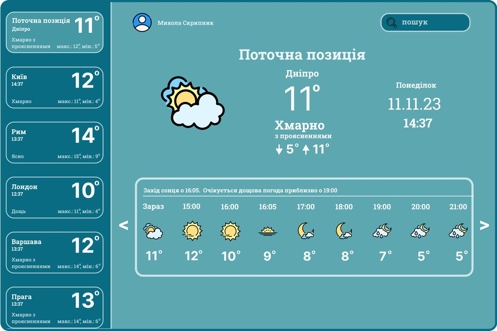

<h1 align="center">🌦 WEATHER APPLICATION</h1>

Цей проєкт створено з метою ознайомлення з:

<ul>
  <li>роботою з <a href="https://developer.mozilla.org/en-US/docs/Glossary/API">API</a></li>
  <li>отриманням та обробкою даних з віддалених серверів</li>
  <li>структурованим зберіганням інформації у <a href="https://www.json.org/json-uk.html">JSON</a> форматі</li>
  <li>створенням інтерфейсу на базі <a href="https://customtkinter.tomschimansky.com/">CustomTkinter</a></li>
  <li>використанням API з <a href="https://openweathermap.org/">OpenWeatherMap</a></li>
</ul>

  

<h2>📑 Зміст</h2>
<ol>
  <li><a href="#модулі-проєкту">Модулі проєкту</a></li>
  <li><a href="#розгортання-проєкту">Розгортання проєкту</a></li>
  <li><a href="#створення-віртуального-оточення">Створення віртуального оточення</a>
    <ul>
      <li><a href="#для-windows">Для Windows</a></li>
      <li><a href="#для-mac-os">Для Mac OS</a></li>
    </ul>
  </li>
  <li><a href="#завантаження-модулів">Завантаження модулів</a>
    <ul>
      <li><a href="#із-requirementstxt">Із requirements.txt</a></li>
      <li><a href="#окремі-модулі">Окремі модулі</a></li>
    </ul>
  </li>
  <li><a href="#старт-проєкту">Старт проєкту</a></li>
  <li><a href="#основні-механіки">Основні механіки</a></li>
  <li><a href="#висновок">Висновок</a></li>
</ol>

<h2 id="модулі-проєкту">🧩 Модулі проєкту</h2>
<ul>
  <li><code>main.py</code> — головний файл запуску застосунку</li>
  <li><code>modules/</code> — модулі для роботи з API, UI, обробкою даних</li>
  <li><code>data_base.json</code> — приклад збереження історії або налаштувань</li>
  <li><code>icons/</code> — ресурси для графічного інтерфейсу</li>
  <li><code>requirements.txt</code> — список необхідних залежностей</li>
</ul>

<h2 id="розгортання-проєкту">🚀 Розгортання проєкту</h2>
<pre><code>git clone https://github.com/your-username/Oleg-Weather-app.git
cd Oleg-Weather-app</code></pre>

<h2 id="створення-віртуального-оточення">🛠 Створення віртуального оточення</h2>

<h3 id="для-windows">Для Windows</h3>
<pre><code>python -m venv venv
venv\Scripts\activate</code></pre>

<h3 id="для-mac-os">Для Mac OS / Linux</h3>
<pre><code>python3 -m venv venv
source venv/bin/activate</code></pre>

<h2 id="завантаження-модулів">📦 Завантаження модулів</h2>

<h3 id="із-requirementstxt">Із <code>requirements.txt</code></h3>
<pre><code>pip install -r requirements.txt</code></pre>

<h3 id="окремі-модулі">Окремі модулі</h3>
<pre><code>pip install customtkinter requests</code></pre>

<h2 id="старт-проєкту">▶ Старт проєкту</h2>
<pre><code>python main.py</code></pre>

<h2 id="основні-механіки">⚙ Основні механіки</h2>
<ul>
  <li>Введення назви міста для отримання прогнозу</li>
  <li>Підключення до OpenWeatherMap API</li>
  <li>Обробка відповіді JSON</li>
  <li>Вивід інформації у графічному інтерфейсі (GUI)</li>
  <li>Просте збереження даних у <code>data_base.json</code></li>
</ul>

<h2 id="висновок">✅ Висновок</h2>

Цей застосунок є чудовим стартовим проєктом для ознайомлення з:

<ul>
  <li>API-запитами</li>
  <li>GUI-програмуванням у Python</li>
  <li>роботою з json-файлами</li>
  <li>принципами структурування Python-проєктів</li>
</ul>
